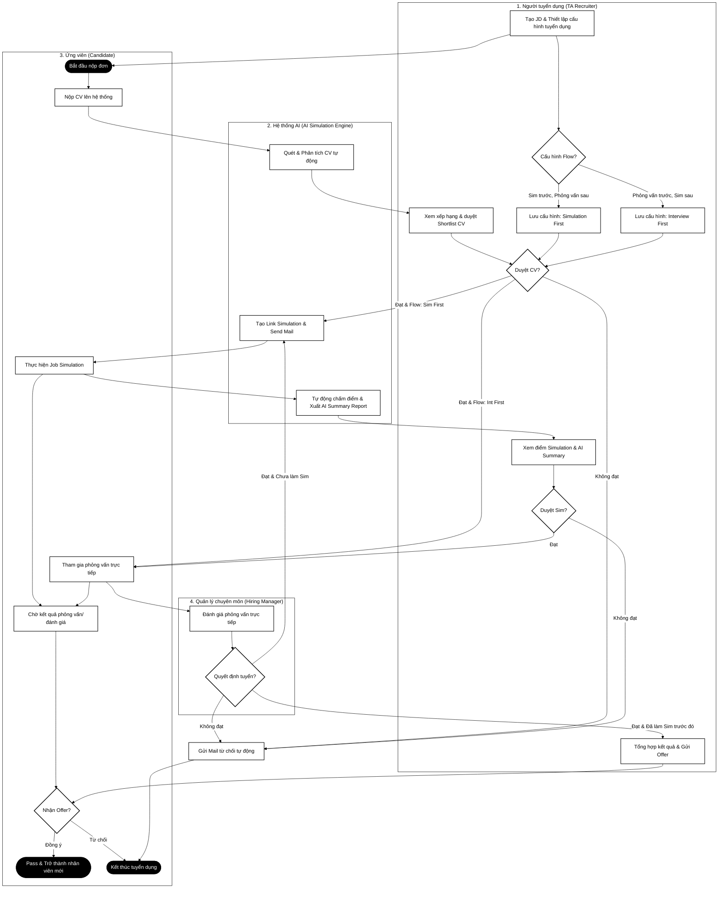
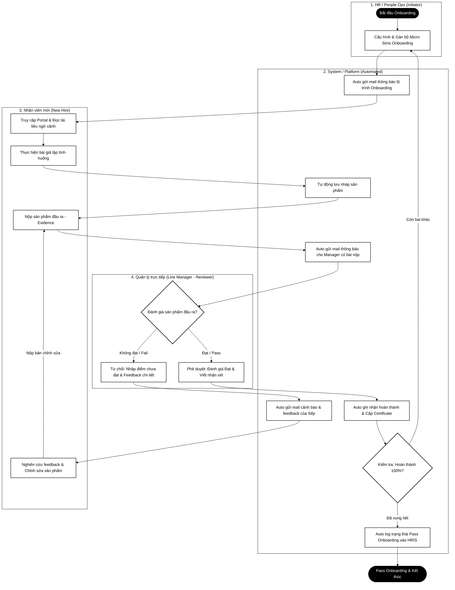
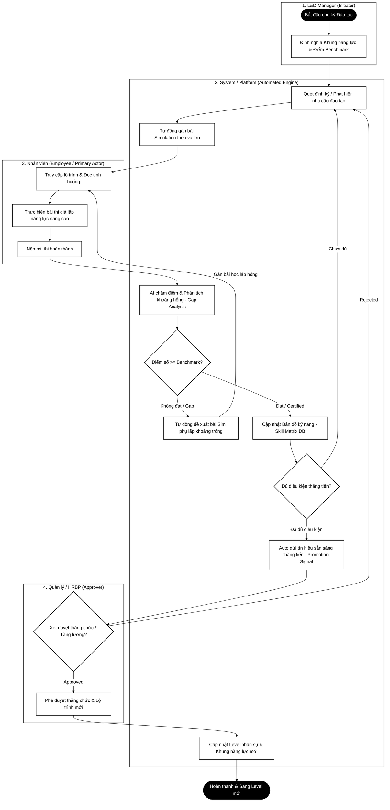

# [LOGO] ──────────────────────────────── BA WORKSPACE PRO
#        BÀI TẬP ĐÁNH GIÁ NĂNG LỰC - VỊ TRÍ IT BA / PO INTERN
#        Dự án: Chuyển đổi Nền tảng Edtronaut B2C sang B2B Suite
# ─────────────────────────────────────────────────────

| Field | Value |
|-------|-------|
| **Document Title** | Tài liệu Tổng hợp Giải pháp Nghiệp vụ & Kỹ thuật (BA/PO Deliverables) |
| **Document ID** | BRD-SRS-EDTRONAUT-B2B-v1.0 |
| **Project** | Edtronaut B2B Enterprise Transition |
| **Version** | v1.0 |
| **Status** | Approved Plan - Draft Implementation |
| **Author** | IT BA / Product Owner Intern |
| **Reviewer** | BA Lead / Senior Mentor |
| **Approver** | Product Owner / Head of Product |
| **Created** | 01/06/2026 |
| **Last Updated** | 01/06/2026 |
| **Confidentiality** | Internal Confidential |

---

> [!IMPORTANT]
> Tài liệu này được biên soạn nghiêm túc, bám sát và giải quyết triệt để đề bài kiểm tra năng lực đầu vào vị trí **IT BA / Product Owner Intern** tại Edtronaut. Mọi giải pháp nghiệp vụ được phân tích dựa trên tư duy **BA-First** (tập trung giải quyết vấn đề gốc rễ, tối ưu hóa quy trình vận hành thực tế cho doanh nghiệp B2B, thay vì chỉ liệt kê tính năng kỹ thuật đơn thuần).

---

## PHẦN A: HỒ SƠ KHÁCH HÀNG (PERSONAS) & CÂU CHUYỆN NGƯỜI DÙNG (USER STORIES)

### 1. Xây dựng 6 Hồ sơ Personas chi tiết

Để chuyển đổi thành công nền tảng Edtronaut từ B2C sang B2B, hệ thống **PHẢI** đáp ứng nhu cầu của cả 3 phân hệ chính: **Tuyển dụng (Hiring)**, **Hội nhập (Onboarding)**, và **Đào tạo nội bộ (Upskilling)**. Dưới đây là chân dung chi tiết của 6 nhóm đối tượng tương ứng:

#### 1.1. Phân hệ Tuyển dụng (Hiring Suite)

##### Persona 1: Người mua hàng/Người dùng chính (TA Lead / Recruiter)
*   **Họ và tên:** Lê Minh Trí (32 tuổi)
*   **Chức vụ:** Talent Acquisition Lead tại một công ty Công nghệ & Tài chính quy mô vừa và lớn.
*   **Bối cảnh làm việc:** Hàng ngày phải quản lý nhiều tin tuyển dụng ở các vị trí khác nhau. Nhận lượng lớn CV gửi về liên tục từ nhiều nguồn khác nhau (LinkedIn, các trang tuyển dụng). Hầu hết thời gian dành cho việc đọc lướt CV, liên hệ ứng viên và lên lịch phỏng vấn.
*   **Top 3 Pain Points lớn nhất:**
    1.  *Lọc CV ảo:* Mất nhiều thời gian sàng lọc CV hàng ngày nhưng gặp tình trạng ứng viên viết CV rất đẹp nhưng khi phỏng vấn lại thiếu kỹ năng thực tế (mismatch giữa CV và năng lực thực tế).
    2.  *Áp lực Time-to-Hire:* KPI tuyển dụng đè nặng, yêu cầu phải nhanh chóng lấp đầy vị trí trống, trong khi quy trình test năng lực chuyên môn truyền thống kéo dài và tốn nhiều nguồn lực phối hợp.
    3.  *Trải nghiệm ứng viên kém:* Do lượng hồ sơ quá lớn, không thể gửi phản hồi chi tiết và kịp thời cho từng ứng viên, làm ảnh hưởng đến thương hiệu tuyển dụng.
*   **Các rào cản & rủi ro chính (Objections):**
    *   *AI Bias (Định kiến AI):* Lo ngại thuật toán lọc tự động của AI có thể bỏ sót ứng viên tiềm năng nếu họ không trình bày CV theo chuẩn từ khóa thông thường.
    *   *Bảo mật thông tin:* E ngại về vấn đề rò rỉ dữ liệu cá nhân của ứng viên khi lưu trữ trên nền tảng của bên thứ ba.
*   **Mục tiêu chính (Motivations):** Tự động hóa phần lớn quy trình sàng lọc kỹ năng bước đầu, có báo cáo đánh giá năng lực thực hành khách quan trước khi phỏng vấn trực tiếp để tối ưu hóa thời gian và nâng cao tỷ lệ phỏng vấn thành công.

##### Persona 2: Người làm bài đánh giá (Candidate / Simulation Taker)
*   **Họ và tên:** Nguyễn Thảo Vy (22 tuổi)
*   **Chức vụ:** Sinh viên năm cuối ngành Hệ thống thông tin quản lý, đang ứng tuyển vị trí BA Intern.
*   **Bối cảnh làm việc:** Đang tích cực rải CV tìm nơi thực tập tốt nghiệp. Nhận được lời mời làm bài Job Simulation kiểm tra năng lực thực tế từ Edtronaut.
*   **Top 3 Pain Points lớn nhất:**
    1.  *Thiếu định hướng:* Làm các bài test lý thuyết trắc nghiệm khô khan, không phản ánh đúng năng lực giải quyết tình huống thực tế của bản thân.
    2.  *Bất an về chấm điểm:* Cảm giác các hệ thống chấm điểm tự động bằng AI thường cứng nhắc, không ghi nhận các giải pháp mang tính sáng tạo hoặc tư duy logic phi tuyến tính.
    3.  *Mất kết nối:* Thường "bị lãng quên" sau khi làm bài test, không nhận được bất kỳ phản hồi nào ngoài email từ chối tự động.
*   **Các rào cản & rủi ro chính (Objections):**
    *   *Gánh nặng thời gian:* Các bài Job Simulation kéo dài gây mệt mỏi, đặc biệt khi ứng viên đang phải làm nhiều bài test khác nhau cùng lúc.
    *   *Sợ bị "dùng chùa" ý tưởng:* Lo lắng các giải pháp mình đưa ra trong bài Simulation sẽ bị doanh nghiệp lấy đi sử dụng thực tế mà không trả phí hoặc không tuyển dụng.
*   **Mục tiêu chính (Motivations):** Có cơ hội cọ xát với công việc thực tế thông qua mô phỏng, nhận được một bản phân tích kỹ năng (Skill Feedback Report) chi tiết từ AI để biết mình cần cải thiện gì, bất kể kết quả tuyển dụng ra sao.

---

#### 1.2. Phân hệ Hội nhập (Onboarding Suite)

##### Persona 3: Nhân viên mới hội nhập (New Hire)
*   **Họ và tên:** Phạm Hoàng Nam (24 tuổi)
*   **Chức vụ:** Junior Business Analyst mới gia nhập công ty.
*   **Bối cảnh làm việc:** Vừa gia nhập công ty, phải tiếp nhận một lượng thông tin khổng lồ: cấu trúc tổ chức, quy trình nghiệp vụ nội bộ, các hệ thống công nghệ đang vận hành và văn hóa công ty.
*   **Top 3 Pain Points lớn nhất:**
    1.  *Overwhelmed (Quá tải thông tin):* Phải đọc hàng trăm trang tài liệu Word, Drive định dạng lộn xộn mà không có sự liên kết hay bối cảnh thực tế.
    2.  *Sợ hỏi:* Mentor hoặc Manager quá bận rộn, bản thân Nam sợ hỏi những câu hỏi cơ bản sẽ bị đánh giá là kém cỏi hoặc thụ động.
    3.  *Mơ hồ về tiến độ:* Không biết mình đã hoàn thành bao nhiêu phần trăm lộ trình thử việc và cần đạt được những cột mốc nào để được pass thử việc.
*   **Các rào cản & rủi ro chính (Objections):**
    *   *Áp lực thi cử:* Cảm thấy việc làm các bài Simulation hội nhập giống như một bài thi áp lực hơn là một hoạt động học tập, dẫn đến tâm lý đối phó.
    *   *Công cụ phức tạp:* Tốn thời gian làm quen với phần mềm mới thay vì tập trung vào nội dung chuyên môn.
*   **Mục tiêu chính (Motivations):** Nhanh chóng nắm bắt quy trình làm việc thực tế tại công ty mới, tự tin thực hiện các task chuyên môn đầu tiên mà không mắc phải các sai lầm ngớ ngẩn (rookie mistakes) nhờ đã được "thử sai" trong môi trường giả lập (Simulation Sandbox).

##### Persona 4: Người quản trị quy trình hội nhập (People Ops / HR Onboarding)
*   **Họ và tên:** Đỗ Thanh Hải (29 tuổi)
*   **Chức vụ:** HR Operations Specialist.
*   **Bối cảnh làm việc:** Quản lý quy trình Onboarding cho lượng nhân sự mới gia nhập hàng tháng trên toàn công ty. Phải phối hợp với Line Manager của từng phòng ban để gán tài liệu và đánh giá thử việc.
*   **Top 3 Pain Points lớn nhất:**
    1.  *Theo dõi thủ công:* Phải quản lý tiến độ Onboarding của từng nhân viên mới qua một file Google Sheet khổng lồ, dễ bị sót hoặc cập nhật trễ.
    2.  *Manager bỏ bê:* Rất khó thúc giục các Line Manager dành thời gian ngồi review và đánh giá kết quả Onboarding của nhân viên mới do họ quá bận rộn.
    3.  *Nội dung lỗi thời:* Tài liệu Onboarding lưu trữ rải rác, khi quy trình thay đổi thì rất khó cập nhật đồng bộ cho tất cả mọi người.
*   **Các rào cản & rủi ro chính (Objections):**
    *   *Rào cản thay đổi (Change Resistance):* Các sếp và nhân viên đã quen với cách làm cũ qua email/chat, ngại chuyển sang sử dụng một nền tảng chuyên biệt.
    *   *Cá nhân hóa khó khăn:* Mỗi phòng ban có một quy trình nghiệp vụ riêng, việc thiết lập lộ trình Onboarding riêng cho từng vị trí trên tool tốn rất nhiều công sức.
*   **Mục tiêu chính (Motivations):** Số hóa và tối ưu hóa quy trình Onboarding, có Dashboard tổng quan trực quan để biết ngay nhân viên nào đang bị tắc nghẽn ở bước nào, giảm thiểu tối đa thời gian vận hành thủ công hàng tuần.

---

#### 1.3. Phân hệ Đào tạo nội bộ (Upskilling Suite)

##### Persona 5: Người quản lý đào tạo & nâng cao năng lực (L&D Manager / HRBP)
*   **Họ và tên:** Trần Đức Mạnh (38 tuổi)
*   **Chức vụ:** L&D Manager kiêm HR Business Partner (HRBP).
*   **Bối cảnh làm việc:** Xây dựng kế hoạch phát triển nguồn nhân lực dài hạn cho công ty. Định kỳ tổ chức các khóa đào tạo nội bộ nhưng gặp khó khăn trong việc đo lường hiệu quả thực tế.
*   **Top 3 Pain Points lớn nhất:**
    1.  *Đánh giá cảm tính:* Thiếu công cụ đo lường chính xác khoảng trống kỹ năng (Skill Gaps) của nhân sự. Việc cử đi học chủ yếu dựa trên đề xuất cảm tính của Line Manager.
    2.  *Đào tạo kém hiệu quả (Low ROI):* Chi ngân sách đáng kể cho các khóa học lý thuyết bên ngoài nhưng sau đó kỹ năng của nhân viên không cải thiện, không áp dụng được vào công việc thực tế.
    3.  *Dữ liệu rời rạc:* Không có một bản đồ năng lực (Skill Matrix) thời gian thực của toàn bộ tổ chức để làm căn cứ hoạch định nhân sự hoặc quy hoạch cán bộ nguồn.
*   **Các rào cản & rủi ro chính (Objections):**
    *   *Tỷ lệ hoàn thành thấp:* Lo ngại nhân viên sẽ bỏ dở giữa chừng các bài Simulation đào tạo vì quá bận làm task dự án hàng ngày.
    *   *AI gợi ý sai lệch:* Sợ thuật toán đề xuất khóa học tự động của hệ thống gợi ý những kỹ năng không thực sự cần thiết cho công việc hiện tại của nhân sự.
*   **Mục tiêu chính (Motivations):** Xây dựng văn hóa học tập chủ động, chứng minh được ROI của hoạt động L&D bằng các số liệu cải thiện năng lực thực tế rõ ràng thông qua điểm số mô phỏng (Simulation metrics), thiết lập lộ trình thăng tiến minh bạch.

##### Persona 6: Nhân viên hiện tại làm simulation để nâng cao tay nghề (Employee)
*   **Họ và tên:** Bùi Anh Tuấn (27 tuổi)
*   **Chức vụ:** Junior Business Analyst tại Edtronaut.
*   **Bối cảnh làm việc:** Đang xử lý các task BA hàng ngày cho một dự án outsource. Muốn nâng cao năng lực để được thăng tiến lên vị trí cao hơn và tăng lương trong đợt review cuối năm.
*   **Top 3 Pain Points lớn nhất:**
    1.  *Học không đi đôi với hành:* Các khóa học công ty tài trợ mang tính lý thuyết cao, không giúp ích nhiều cho việc giải quyết các vấn đề phức tạp trong dự án thực tế.
    2.  *Không biết mình yếu gì:* Không nhận được feedback chi tiết, khách quan về các kỹ năng cụ thể (ví dụ: kỹ năng viết spec, kỹ năng đàm phán yêu cầu).
    3.  *Lộ trình mông lung:* Không rõ mình cần phải cải thiện chính xác những kỹ năng nào và đạt mức độ bao nhiêu để đủ điều kiện thăng tiến.
*   **Các rào cản & rủi ro chính (Objections):**
    *   *Sợ bị phạt:* Lo lắng nếu làm bài test Simulation đạt điểm thấp sẽ bị sếp đánh giá kém năng lực và ảnh hưởng đến kết quả đánh giá hiệu suất (KPI) cuối năm.
    *   *Burnout (Kiệt sức):* Gánh nặng công việc dự án hàng ngày đã quá lớn, không còn thời gian và năng lượng để làm bài Simulation đào tạo.
*   **Mục tiêu chính (Motivations):** Có một lộ trình phát triển năng lực cá nhân hóa (Personalized Learning Path) rõ ràng, được thực hành giải quyết các case-study thực tế khó hơn của công ty để chứng minh năng lực thăng tiến trực tiếp với sếp bằng số liệu khách quan.

---

### 2. Thiết lập 3 User Stories chuẩn INVEST (Module Hiring)

Để giải quyết triệt để nhu cầu của **Lê Minh Trí (TA Lead)**, chúng ta sẽ thiết kế 3 User Stories cốt lõi cho phân hệ **Tuyển dụng (Hiring)**. Cả 3 stories này đều đạt chuẩn **INVEST** khắt khe:

#### Bảng 1.1: INVEST Assessment cho 3 User Stories

| Tiêu chí | US-HIR-001: Lọc ứng viên theo điểm số AI | US-HIR-002: Cấu hình linh hoạt Quy trình tuyển dụng (Flow Manager) | US-HIR-003: Gửi lời mời làm Simulation hàng loạt |
| :--- | :--- | :--- | :--- |
| **I**ndependent | **Đạt**. Có thể phát triển và triển khai độc lập trên danh sách ứng viên hiện có mà không phụ thuộc vào các tính năng cấu hình nâng cao. | **Đạt**. Chỉ liên quan đến phần lưu trữ cấu hình Job và điều hướng ứng viên, hoạt động tách biệt với việc tính toán điểm số. | **Đạt**. Tập trung vào hành động bulk action gửi email mời làm bài, hoạt động độc lập với bộ lọc điểm số. |
| **N**egotiable | **Đạt**. Scope có thể thương lượng về cách hiển thị dải điểm (slider hay nhập số) hoặc cách hiển thị rank AI (theo phần trăm hay phân hạng A/B/C). | **Đạt**. Giải pháp kỹ thuật có thể thay đổi từ giao diện kéo thả (drag-and-drop) phức tạp sang chọn thứ tự số (Dropdown 1, 2) đơn giản trong MVP. | **Đạt**. Số lượng ứng viên giới hạn gửi một lần có thể giới hạn ở mức 20-50 để đảm bảo hiệu năng và tránh bị spam mail. |
| **V**aluable | **Đạt**. Mang lại giá trị trực tiếp cho Recruiter: giảm 90% thời gian tìm kiếm ứng viên tiềm năng trong database. | **Đạt**. Giải quyết vấn đề thu hút ứng viên: linh hoạt thay đổi để tối ưu hóa tỷ lệ drop-off của ứng viên ở các level khác nhau. | **Đạt**. Tiết kiệm thời gian vận hành: giảm thao tác lặp đi lặp lại từ 50 lần click xuống còn 2 lần click. |
| **E**stimable | **Đạt**. Yêu cầu rõ ràng về bộ lọc dữ liệu SQL và hiển thị UI Table. Effort ước lượng khoảng 3-5 Story Points. | **Đạt**. Yêu cầu về cấu hình database lưu trạng thái và logic định tuyến link. Effort ước lượng khoảng 8 Story Points. | **Đạt**. Tích hợp với dịch vụ gửi mail (SendGrid/Amazon SES) và sinh mã link duy nhất. Effort ước lượng khoảng 5 Story Points. |
| **S**mall | **Đạt**. Đủ nhỏ để phát triển, kiểm thử và hoàn thành trong vòng 1 Sprint (3 tuần). | **Đạt**. Có thể chia nhỏ thành các sub-tasks: Cấu hình DB -> API Lưu cấu hình -> UI Cấu hình -> Logic định tuyến ứng viên. | **Đạt**. Đủ nhỏ, tập trung chính vào API bulk send và cập nhật trạng thái đồng loạt. |
| **T**estable | **Đạt**. Có thể viết test cases rõ ràng kiểm tra điều kiện lọc điểm số biên và kết quả hiển thị trên bảng. | **Đạt**. Có thể kiểm thử bằng cách đổi cấu hình và kiểm tra ứng viên nộp đơn mới có nhận đúng flow hướng dẫn hay không. | **Đạt**. Có thể kiểm thử bằng cách chọn bulk gửi, kiểm tra hộp thư ứng viên nhận đúng link riêng biệt và trạng thái DB thay đổi. |

#### Chi tiết Yêu cầu (Specs) của 3 User Stories:

##### US-HIR-001: Lọc ứng viên theo điểm số AI (Candidate Filter & Ranking)
*   **User Story:**
    *   **As a** TA Recruiter (Lê Minh Trí),
    *   **I want to** lọc danh sách ứng viên dựa trên dải điểm số tổng hợp của Job Simulation và phân hạng Rank AI (A, B, C, D),
    *   **So that** tôi có thể ngay lập tức định vị được nhóm ứng viên xuất sắc nhất và ưu tiên liên hệ phỏng vấn trước, loại bỏ phần lớn thời gian xem hồ sơ không đạt yêu cầu.
*   **Acceptance Criteria (Gherkin format):**
    ```gherkin
    Scenario: Lọc thành công danh sách ứng viên đạt chuẩn điểm số cao
      Given Recruiter "Lê Minh Trí" đã đăng nhập và đang ở màn hình Recruitment Pipeline
      And danh sách đang hiển thị các ứng viên của Job "Product Owner Intern"
      When Recruiter chọn lọc danh sách theo dải điểm số và thứ hạng Rank AI mong muốn
      And bấm nút "Áp dụng bộ lọc"
      Then hệ thống hiển thị danh sách ứng viên đã được lọc theo đúng tiêu chí
      And bảng danh sách chỉ hiển thị những ứng viên có điểm số và xếp hạng tương ứng
      And chỉ số tổng ở góc bảng cập nhật số lượng ứng viên đạt điều kiện trên tổng số ứng viên
      And hiển thị một nút "Xóa bộ lọc" bên cạnh thanh lọc dữ liệu để quay lại danh sách gốc.
    ```
*   **Out-of-Scope cho MVP v1:** Lọc nâng cao kết hợp phân tích sâu kỹ năng mềm (ví dụ: chỉ lọc ứng viên có điểm 'Giao tiếp' > 85), việc này sẽ phát triển ở Phase 2.

##### US-HIR-002: Cấu hình linh hoạt Quy trình tuyển dụng (Flow Manager)
*   **User Story:**
    *   **As a** TA Recruiter (Lê Minh Trí),
    *   **I want to** cấu hình tráo đổi thứ tự hai bước "Làm Simulation" và "Phỏng vấn trực tiếp" một cách linh hoạt cho từng Job Description cụ thể,
    *   **So that** tôi có thể áp dụng quy trình phù hợp nhất cho từng cấp bậc tuyển dụng (ví dụ: Vị trí Junior cần làm Simulation trước để lọc bớt số lượng lớn; Vị trí Senior cần phỏng vấn trước để tạo kết nối và thuyết phục họ làm test sau).
*   **Acceptance Criteria (Gherkin format):**
    ```gherkin
    Scenario: Cấu hình đổi thứ tự quy trình tuyển dụng thành công
      Given Recruiter đang ở trang cấu hình quy trình tuyển dụng của Job "Senior BA"
      And trạng thái quy trình hiện tại đang áp dụng một luồng mặc định
      When Recruiter thay đổi thứ tự quy trình tuyển dụng (ví dụ: chuyển sang Phỏng vấn trước, làm bài test sau)
      And bấm nút "Lưu thay đổi"
      Then hệ thống hiển thị thông báo cập nhật quy trình thành công
      And hệ thống tự động áp dụng cấu hình mới cho tin tuyển dụng này
      And đối với ứng viên nộp đơn mới, hệ thống áp dụng đúng thứ tự quy trình vừa cấu hình
      And hệ thống hiển thị tùy chọn gửi bài đánh giá hoặc đặt lịch phỏng vấn tương ứng với bước tiếp theo trong quy trình mới.
    ```
*   **Out-of-Scope cho MVP v1:** Giao diện kéo thả tự do nhiều bước (Drag-and-drop workflow builder). MVP chỉ hỗ trợ nút chuyển đổi nhanh (Toggle Switch) giữa 2 flow định sẵn: "Simulation First" vs "Interview First".

##### US-HIR-003: Gửi lời mời làm Simulation hàng loạt (Bulk Simulation Invite)
*   **User Story:**
    *   **As a** TA Recruiter (Lê Minh Trí),
    *   **I want to** chọn hàng loạt ứng viên từ bảng danh sách và kích hoạt gửi email mời làm bài Job Simulation đồng loạt với cùng một thiết lập deadline,
    *   **So that** tôi không phải thực hiện thao tác click vào từng ứng viên và gửi email thủ công nhiều lần, đảm bảo tất cả ứng viên trong cùng một đợt có thời gian làm bài đồng bộ.
*   **Acceptance Criteria (Gherkin format):**
    ```gherkin
    Scenario: Gửi lời mời làm Simulation hàng loạt thành công
      Given Recruiter đang xem danh sách ứng viên ở giai đoạn chờ sàng lọc (Applied)
      And Recruiter đã tích chọn nhiều ứng viên từ danh sách
      When Recruiter chọn hành động gửi lời mời làm bài hàng loạt
      And thiết lập thời hạn làm bài (Deadline) mong muốn
      And bấm nút xác nhận gửi
      Then hệ thống hiển thị trạng thái đang gửi lời mời đến các ứng viên được chọn
      And hệ thống hoàn thành việc gửi email mời làm bài
      And hiển thị thông báo gửi thành công với số lượng ứng viên tương ứng
      And trạng thái tuyển dụng của các ứng viên này lập tức được cập nhật sang trạng thái đã gửi bài
      And hệ thống ghi nhận lịch sử gửi lời mời kèm thời hạn làm bài vào lịch sử hoạt động của từng ứng viên.
    ```
*   **Out-of-Scope cho MVP v1:** Cấu hình mẫu email tùy chỉnh (Custom Email Template Editor) cho mỗi lượt gửi. MVP v1 sẽ sử dụng một email template mặc định đã được thiết lập sẵn trong cài đặt hệ thống.

##### US-HIR-004: Xem thời hạn làm bài và hướng dẫn (Candidate)
*   **User Story:**
    *   **As a** Ứng viên (Nguyễn Thảo Vy),
    *   **I want to** xem thời hạn làm bài đánh giá, thời lượng ước tính và các hướng dẫn rõ ràng trên trang bắt đầu Job Simulation,
    *   **So that** tôi có thể chuẩn bị môi trường làm việc tốt nhất và phân bổ thời gian hợp lý để hoàn thành bài test trước khi link hết hạn.
*   **Acceptance Criteria (Gherkin format):**
    ```gherkin
    Scenario: Ứng viên xem trang giới thiệu và hướng dẫn thi thành công
      Given Ứng viên click vào link làm bài duy nhất nhận được trong email
      When trang giới thiệu (assessment landing page) được tải thành công
      Then hệ thống hiển thị chính xác Tên Job ứng tuyển "BA Intern" và logo doanh nghiệp
      And hiển thị rõ ràng thời hạn làm bài (Ví dụ: "Trước ngày DD/MM/YYYY, HH:MM")
      And hiển thị thời gian làm bài dự kiến (Ví dụ: "Thời lượng: 90 phút")
      And hiển thị danh sách các quy định và yêu cầu kỹ thuật dưới dạng bulleted list
      And hiển thị nút "Bắt đầu làm bài" nổi bật để kích hoạt bộ đếm thời gian.
    ```

##### US-HIR-005: Thực hiện và nộp bài đánh giá giả lập (Candidate)
*   **User Story:**
    *   **As a** Ứng viên (Nguyễn Thảo Vy),
    *   **I want to** nộp kết quả thực hiện bài Job Simulation trực tiếp trên portal thi trực tuyến,
    *   **So that** hệ thống AI Simulation Engine ghi nhận và chuyển sang bước chấm điểm tự động.
*   **Acceptance Criteria (Gherkin format):**
    ```gherkin
    Scenario: Ứng viên nộp bài thi giả lập thành công
      Given Ứng viên đã hoàn thành tất cả các nhiệm vụ giả lập trong portal thi
      When Ứng viên bấm nút "Nộp bài đánh giá"
      And tích chọn xác nhận trong hộp thoại cảnh báo nộp bài
      Then hệ thống hiển thị màn hình thông báo: "Nộp bài thành công"
      And cập nhật trạng thái làm bài của ứng viên trong database sang "Simulation Completed"
      And khóa quyền chỉnh sửa các câu trả lời của ứng viên trên portal.
    ```

##### US-HIR-006: Nhận Báo cáo đánh giá năng lực chi tiết (Candidate)
*   **User Story:**
    *   **As a** Ứng viên (Nguyễn Thảo Vy),
    *   **I want to** nhận được một Báo cáo phản hồi kỹ năng (Skill Feedback Report) tự động qua email sau khi bài thi được chấm điểm,
    *   **So that** tôi hiểu rõ điểm mạnh và điểm cần cải thiện của bản thân, đảm bảo trải nghiệm ứng tuyển minh bạch bất kể kết quả cuối cùng.
*   **Acceptance Criteria (Gherkin format):**
    ```gherkin
    Scenario: Ứng viên nhận được email kèm báo cáo phản hồi kỹ năng tự động
      Given Ứng viên đã nộp bài giả lập
      And hệ thống AI và Recruiter đã hoàn thành việc chấm điểm
      When hệ thống cập nhật trạng thái của ứng viên sang "Simulation Evaluated"
      Then hệ thống tự động gửi email thông báo kèm link tải file PDF Skill Feedback Report
      And báo cáo phản hồi hiển thị điểm số trên 3 khía cạnh: Độ chính xác, Kỹ năng mềm, Tư duy Logic
      And báo cáo bao gồm các nhận xét mang tính xây dựng của AI mà không tiết lộ đáp án bài thi.
    ```

##### US-HIR-007: Xem danh sách ứng viên rút gọn của phòng ban (Hiring Manager)
*   **User Story:**
    *   **As a** Quản lý chuyên môn (Trần Đức Mạnh),
    *   **I want to** xem danh sách ứng viên đã được rút gọn (shortlist) thuộc phòng ban của mình,
    *   **So that** tôi có thể tập trung đánh giá đúng những ứng viên tiềm năng đã vượt qua vòng lọc kỹ năng ban đầu.
*   **Acceptance Criteria (Gherkin format):**
    ```gherkin
    Scenario: Quản lý chuyên môn xem danh sách ứng viên đã lọc của bộ phận
      Given Quản lý chuyên môn "Trần Đức Mạnh" đã đăng nhập vào hệ thống
      When hệ thống tải danh sách Recruitment Pipeline thuộc bộ phận tương ứng
      Then bảng danh sách chỉ hiển thị các ứng viên thuộc bộ phận "Công nghệ & Tài chính"
      And chỉ hiển thị các ứng viên có trạng thái từ "Simulation Completed" trở đi
      And ẩn toàn bộ thông tin ứng viên của các phòng ban khác.
    ```

##### US-HIR-008: Thêm nhận xét đánh giá chi tiết (Hiring Manager)
*   **User Story:**
    *   **As a** Quản lý chuyên môn (Trần Đức Mạnh),
    *   **I want to** viết ghi chú đánh giá (Reviewer Notes) trực tiếp trên trang chi tiết ứng viên,
    *   **So that** tôi có thể lưu trữ nhận xét chuyên môn và phối hợp với Recruiter để đưa ra quyết định tuyển dụng thống nhất.
*   **Acceptance Criteria (Gherkin format):**
    ```gherkin
    Scenario: Quản lý chuyên môn lưu nhận xét đánh giá thành công
      Given Quản lý chuyên môn đang xem trang chi tiết của ứng viên "Nguyễn Thảo Vy"
      When Quản lý nhập nhận xét "Tư duy phân tích spec rất sạch sẽ, sẵn sàng phỏng vấn" vào ô Reviewer Notes
      And bấm nút "Lưu nhận xét"
      Then hệ thống hiển thị nhận xét mới ở danh sách ghi chú kèm Tên người duyệt và Timestamp
      And ghi nhận hoạt động "Thêm ghi chú đánh giá" vào Lịch sử hoạt động (Activity Timeline) của ứng viên.
    ```

##### US-HIR-009: Phê duyệt danh sách phỏng vấn trực tiếp (Hiring Manager)
*   **User Story:**
    *   **As a** Quản lý chuyên môn (Trần Đức Mạnh),
    *   **I want to** bấm phê duyệt hoặc từ chối ứng viên vào vòng phỏng vấn trực tiếp tiếp theo,
    *   **So that** Recruiter nhận được thông báo để kịp thời lên lịch phỏng vấn hoặc gửi thư từ chối cho ứng viên.
*   **Acceptance Criteria (Gherkin format):**
    ```gherkin
    Scenario: Quản lý chuyên môn phê duyệt ứng viên vào vòng phỏng vấn thành công
      Given Quản lý chuyên môn đang xem trang chi tiết của ứng viên "Nguyễn Thảo Vy"
      When Quản lý bấm nút "Duyệt phỏng vấn (Approve to Interview)"
      Then hệ thống tự động cập nhật trạng thái tuyển dụng của ứng viên sang "Interview Scheduled"
      And tự động gửi email thông báo cho Recruiter phụ trách Job này để chuẩn bị lịch phỏng vấn.
    ```

---

## PHẦN B: THIẾT KẾ QUY TRÌNH NGHIỆP VỤ (BUSINESS PROCESSES DESIGN)

Để hiện thực hóa 3 phân hệ chính của Edtronaut B2B, chúng ta **PHẢI** định nghĩa rõ ràng quy trình vận hành của từng phân hệ. Điểm mấu chốt là **lựa chọn loại sơ đồ phù hợp nhất với bản chất của từng quy trình** để tối đa hóa hiệu quả truyền đạt kỹ thuật và nghiệp vụ, tránh việc vẽ rập khuôn 3 flowchart giống hệt nhau.

---

### Quy trình 1: Tự động hóa tuyển dụng (Hiring Automation)
*   **Loại sơ đồ sử dụng:** **BPMN Swimlane Diagram (Pool & Lanes)**
*   **Lý do lựa chọn:** Quy trình này có sự tham gia tương tác phức tạp của nhiều đối tượng (Candidate, Recruiter, AI System, Hiring Manager) với nhiều điểm rẽ nhánh quyết định (Gateways), đặc biệt là logic hoán đổi linh hoạt của **Flow Manager**. BPMN Swimlane thể hiện cực kỳ rõ ràng ranh giới trách nhiệm (Ownership) và luồng trao đổi thông điệp (Message flows) xuyên suốt.


*Hình 2.1: Sơ đồ Quy trình Tuyển dụng Tự động hóa (BPMN Swimlane Diagram)*

> [!NOTE]
> **Điểm cải tiến nghiệp vụ cốt lõi (Flow Manager):**
> Nhờ cấu hình linh hoạt được lưu từ lúc tạo JD, hệ thống AI tự động phân luồng ứng viên sau khi Recruiter duyệt CV. Sơ đồ thể hiện rõ 2 con đường:
> 1. *Luồng 1 (Simulation First):* CV Đạt → Auto gửi Sim → Làm bài → Đạt điểm → Phỏng vấn.
> 2. *Luồng 2 (Interview First):* CV Đạt → Phỏng vấn trực tiếp → Phỏng vấn Đạt → Mới gửi link làm Sim để đánh giá kỹ năng thực thi cuối cùng.
> Việc phân quyền dữ liệu được đảm bảo: Bảng điểm và AI Report chỉ đổ về Lane của Recruiter và Hiring Manager để đánh giá, ứng viên chỉ nhận được kết quả cuối cùng.

---

### Quy trình 2: Hội nhập nhân viên mới (New Hire Onboarding)
*   **Loại sơ đồ sử dụng:** **Flowchart có Swimlanes (Cross-Functional Flowchart)**
*   **Lý do lựa chọn:** Quy trình Onboarding có sự tham gia của 4 Actor chính (HR/People Ops, System, New Hire, Line Manager) hoạt động phân chia theo vai trò. Flowchart Swimlanes giúp biểu diễn trực quan các điểm bàn giao công việc (handoffs) giữa các bên, đồng thời thể hiện xuất sắc **vòng lặp phản hồi đóng (cyclic feedback loop)** khi sản phẩm đầu ra của New Hire cần chỉnh sửa và sếp kiểm duyệt lại theo đúng tiêu chuẩn ISO 5807.


*Hình 2.2: Sơ đồ Quy trình Hội nhập Onboarding (Cross-Functional Swimlane Flowchart)*

> [!NOTE]
> **Điểm mấu chốt kỹ thuật:**
> Vòng lặp phản hồi đóng (Feedback Loop) được biểu diễn trực quan bằng nét đứt `-.->` quay ngược về bước sửa đổi của New Hire. Trách nhiệm được phân làn rõ rệt giữa System (chạy tự động) và Manager/HR (quyết định thủ công). Mọi node tuân thủ nghiêm ngặt tiêu chuẩn ký hiệu ISO 5807 (Oval cho Start/End, Rectangle cho Process, Diamond cho Decision).

---

### Quy trình 3: Đào tạo nội bộ (Upskilling Continuous Loop)
*   **Loại sơ đồ sử dụng:** **Flowchart + Sơ đồ vòng lặp đóng (Continuous Loop Diagram)**
*   **Lý do lựa chọn:** Hoạt động đào tạo nâng cao năng lực (Upskilling) của doanh nghiệp thực chất là một **chu kỳ phát triển liên tục, không khép kín** (Continuous Learning Loop). Flowchart kết hợp Loop Diagram phân làn giúp mô tả rõ nét cách hệ thống quét lỗ hổng năng lực (Gap Analysis), tự động gán bài học lấp khoảng trống kỹ năng, đồng thời bắn tín hiệu thăng tiến (Promotion Signal) đến quản lý xét duyệt theo chuẩn ISO 5807.


*Hình 2.3: Sơ đồ Chuyển đổi Vòng lặp Đào tạo liên tục (Closed-loop Swimlane Flowchart)*

> [!NOTE]
> **Giải thích hoạt động của Vòng lặp đóng (Closed-loop):**
> 1. Trạng thái quét định kỳ tự động `Auto_Trigger_Need` khởi đầu quá trình.
> 2. Nếu kiểm tra `Check_Score` không đạt benchmark, hệ thống kích hoạt hộp cảnh báo `Auto_Recommend_Sim` và gán lộ trình sửa lỗi (remdiation loop) nét đứt `-.->` về bước học của nhân viên.
> 3. Tích lũy kỹ năng đạt chuẩn `Update_Skill_Matrix` sẽ kích hoạt kiểm tra điều kiện thăng tiến `Check_Level_Complete`. Nếu đạt, tín hiệu tự động thăng chức `Trigger_Promo_Signal` được bắn sang cho quản lý chuyên môn và HRBP để xét duyệt `Promo_Review`. Khi duyệt thành công `LM_Approve_Promo`, hệ thống tự động cập nhật Level mới và nạp Khung năng lực mới, bắt đầu chu kỳ đào tạo tiếp theo của bậc kỹ năng cao hơn.

---

## PHẦN C: ĐẶC TẢ YÊU CẦU PHÂN HỆ TUYỂN DỤNG (PRD/SRS) & MOCKUP DASHBOARD

Dưới đây là tài liệu Đặc tả Yêu cầu Kỹ thuật (SRS) chi tiết cho **Recruitment Dashboard (Scope 1)**, được cấu trúc theo chuẩn bàn giao chất lượng cao nhất cho đội ngũ Phát triển Phần mềm (Developers) và Kiểm thử (QA).

---

### 1. Tuyên bố Vấn đề & Mục tiêu (Problem & Goals)

#### 1.1. Problem Statement
Hiện tại, đội ngũ tuyển dụng (TA Recruiter) của khách hàng doanh nghiệp B2B đang thực hiện quy trình đánh giá ứng viên một cách thủ công và rời rạc. CV được lưu trữ trên email hoặc ATS cơ bản; bài test kỹ năng được gửi thủ công qua Google Forms hoặc PDF; việc phỏng vấn ghi chép trên sổ tay hoặc file Word chung. Sự thiếu kết nối này dẫn đến:
*   *Tỷ lệ tuyển sai người (Bad Hire Rate) cao:* Không có công cụ kiểm chứng năng lực thực tế khách quan, ứng viên có thể sao chép code hoặc tài liệu trên mạng để nộp.
*   *Lãng phí thời gian:* Recruiter mất trung bình 45 phút cho mỗi hồ sơ để đọc, gửi test, thu bài và phối hợp với Hiring Manager để chấm điểm.
*   *Thiếu tập trung dữ liệu:* Không có một nơi duy nhất hiển thị toàn cảnh bức tranh kỹ năng của ứng viên (Accurary, Soft skills, Time taken) và các đánh giá từ các phòng ban.

#### 1.2. Product Goals
*   Xây dựng màn hình **Recruitment Dashboard** tập trung, đóng vai trò là "Single Source of Truth" cho toàn bộ quy trình tuyển dụng của doanh nghiệp.
*   Tích hợp trực tiếp kết quả từ **AI Job Simulation Engine** để trực quan hóa năng lực ứng viên ngay trên bảng danh sách.
*   Hỗ trợ ra quyết định nhanh chóng thông qua hệ thống xếp hạng tự động của AI và các bộ lọc thông minh.

#### 1.3. Non-goals (Không thuộc phạm vi sản phẩm)
*   Hệ thống không thay thế hoàn toàn phần mềm quản lý tuyển dụng ATS sẵn có của doanh nghiệp (như Workable, Greenhouse), mà hoạt động dưới dạng tích hợp qua API.
*   Hệ thống không tự động đưa ra quyết định từ chối cuối cùng đối với ứng viên mà không có sự xác nhận thủ công của Recruiter hoặc Hiring Manager (Quy tắc **Human-in-the-loop**).

---

### 2. Phân chia Phạm vi Phát triển (MVP vs. Phase 2+)

Để đảm bảo sản phẩm ra mắt đúng hạn và giảm thiểu rủi ro kỹ thuật, phạm vi tính năng được phân kỳ rõ ràng như sau:

#### Bảng 3.1: Phân kỳ Phạm vi Tính năng (Feature Scoping)

| Module | Tính năng trong MVP (In-Scope v1) | Tính năng nâng cấp (Phase 2+) |
| :--- | :--- | :--- |
| **Quản lý danh sách** | hiển thị bảng danh sách ứng viên tập trung kèm cột: Điểm số, Rank AI, Trạng thái làm bài, Last Update. | Tự động đồng bộ ứng viên thời gian thực (Real-time Sync) từ các nền tảng ATS bên ngoài qua Webhooks. |
| **Cấu hình Quy trình** | Nút Toggle chuyển đổi nhanh 2 chế độ: Simulation First vs. Interview First cho mỗi Job. | Công cụ vẽ Workflow kéo thả (Drag-and-drop workflow builder) tự do thiết lập không giới hạn bước. |
| **Hành động nhanh** | Check chọn gửi bài Simulation hàng loạt (Bulk Send) lên tới tối đa 50 ứng viên bằng mẫu mail mặc định. | Tự soạn mẫu thư mời (Email Template Editor), đặt lịch hẹn gửi email tự động theo khung giờ vàng. |
| **AI Assessment** | Hiển thị điểm số tổng hợp và bản mô tả ngắn AI Summary (Narrative Summary) về điểm mạnh/yếu trong chi tiết ứng viên. | AI tự động so sánh ứng viên với Benchmarks của phòng ban và vẽ biểu đồ hình nhện so sánh kỹ năng (Skill Chart comparison). |
| **Xuất báo cáo** | Xuất danh sách ứng viên rút gọn (Shortlist) ra file định dạng CSV phẳng đơn giản. | Xuất báo cáo đồ họa PDF chuyên sâu chứa đầy đủ bằng chứng bài test (Evidence) để trình bày trực tiếp trong họp. |

---

### 3. Yêu cầu Chức năng chi tiết (Functional Requirements)

Hệ thống **PHẢI** tuân thủ các đặc tả chức năng được liệt kê dưới đây:

#### Bảng 3.2: Danh sách Yêu cầu Chức năng (Functional Requirements List)

| Requirement ID | Module | Chi tả Yêu cầu Nghiệp vụ (RFC 2119 Standards) | Priority |
| :--- | :--- | :--- | :--- |
| **FR-DASH-001** | Dashboard | Hệ thống **PHẢI** hiển thị phễu số liệu trực quan (Recruitment Funnel) gồm các giai đoạn: Applied → Sim Sent → Sim Completed → Interviewing → Offered → Hired. | **PHẢI** (Must) |
| **FR-DASH-002** | Dashboard | Hệ thống **PHẢI** hiển thị khu vực "Action Required" nổi bật chứa danh sách ứng viên đã hoàn thành Simulation nhưng chưa được Recruiter review quá 48 tiếng. | **PHẢI** (Must) |
| **FR-LIST-001** | Candidate List | Bảng danh sách ứng viên **PHẢI** hỗ trợ phân trang (Pagination) mặc định 20 dòng/trang và cho phép tìm kiếm theo Tên ứng viên, Email, hoặc Số điện thoại. | **PHẢI** (Must) |
| **FR-LIST-002** | Candidate List | Recruiter **PHẢI** có thể lọc danh sách ứng viên theo: Tên Job tuyển dụng, Dải điểm Simulation (Slider), Phân hạng Rank AI, Trạng thái (Stage) tuyển dụng. | **PHẢI** (Must) |
| **FR-ACT-001** | Bulk Actions | Hệ thống **PHẢI** cho phép tích chọn nhiều ứng viên cùng lúc để thực hiện hành động bulk action: Gửi Simulation hoặc Chuyển stage hàng loạt. | **PHẢI** (Must) |
| **FR-DETAIL-001**| Candidate Detail | Khi click vào tên ứng viên, hệ thống **PHẢI** hiển thị trang chi tiết chứa 3 tab thông tin chính: 1. Thông tin CV & Hồ sơ cá nhân; 2. Báo cáo đánh giá chi tiết bài Simulation (Độ chính xác, Kỹ năng mềm, Thời gian làm bài); 3. Lịch sử hoạt động và Nhận xét của người duyệt (Reviewer Notes). | **PHẢI** (Must) |
| **FR-DETAIL-002**| Candidate Detail | Recruiter **PHẢI** có thể thêm nhận xét mới (Reviewer Notes) kèm theo quyết định duyệt ứng viên: "Approve to Interview" hoặc "Reject Candidate". | **PHẢI** (Must) |
| **FR-RBAC-001** | Security/RBAC | Hệ thống **PHẢI** phân quyền truy cập: TA Recruiter có quyền chỉnh sửa cấu hình, gửi test và đưa ra quyết định; Hiring Manager chỉ có quyền xem (Read-only) danh sách ứng viên của phòng ban mình và viết nhận xét (Reviewer Notes) vào trang chi tiết, không được đổi cấu hình hệ thống. | **PHẢI** (Must) |

---

### 4. Yêu cầu Phi chức năng (Non-Functional Requirements)

Để hệ thống hoạt động ổn định và đáp ứng các tiêu chuẩn doanh nghiệp khắt khe, các yêu cầu phi chức năng sau **PHẢI** được đáp ứng:

*   **NFR-PERF-001 (Hiệu năng tải trang):** Màn hình Recruitment Dashboard chính **PHẢI** tải trong vòng 1.5 giây với tập dữ liệu lên tới 1,000 ứng viên đồng thời dưới điều kiện kết nối mạng tiêu chuẩn.
*   **NFR-PERF-002 (Cập nhật dữ liệu):** API endpoint truyền dữ liệu điểm số từ AI Simulation Engine về Dashboard **PHẢI** phản hồi dưới 1.0 giây để đảm bảo tính cập nhật thời gian thực khi Recruiter đánh giá.
*   **NFR-SEC-001 (Bảo mật dữ liệu):** Toàn bộ dữ liệu cá nhân của ứng viên (PII bao gồm tên, email, số điện thoại, CV và điểm số) **PHẢI** được mã hóa khi lưu trữ (at rest) sử dụng tiêu chuẩn mã hóa AES-256.
*   **NFR-COMP-001 (Quyền được xóa dữ liệu - PDPA):** Hệ thống **PHẢI** hỗ trợ cơ chế quyền được xóa dữ liệu (Right to Erasure theo PDPA/GDPR). Khi nhận được yêu cầu hợp lệ, hệ thống phải xóa sạch hoàn toàn mọi thông tin liên quan (CV, các lượt làm bài, điểm số, nhận xét) trong vòng 72 giờ và tự động ghi nhật ký xác nhận xóa.
*   **NFR-AUD-001 (Nhật ký kiểm toán):** Hệ thống **PHẢI** tự động ghi lại nhật ký kiểm toán bất biến (immutable audit log) cho các thao tác nhạy cảm (như gửi bài Simulation, thay đổi điểm số, điều chỉnh cấu hình tuyển dụng, bulk actions). Mỗi bản ghi log **PHẢI** chứa: User ID, IP Address, Action Type, Timestamp, và Old Value vs. New Value. Nhật ký kiểm toán không được phép sửa/xóa bởi bất cứ quyền nào và **PHẢI** được lưu trữ tối thiểu 2 năm.

---

### 5. Thực thể Dữ liệu (Data Model Entities)

Bản thiết kế cơ sở dữ liệu nhẹ để hỗ trợ tính năng Recruitment Dashboard:

```
┌──────────────────┐          ┌──────────────────┐          ┌───────────────────────┐
│       Job        │1        *│    Candidate     │1        *│  Simulation_Attempt   │
├──────────────────┤          ├──────────────────┤          ├───────────────────────┤
│ id (PK)          ├─────────>│ id (PK)          ├─────────>│ id (PK)               │
│ title            │          │ name             │          │ candidate_id (FK)     │
│ department       │          │ email            │          │ job_id (FK)           │
│ status           │          │ phone            │          │ started_at            │
│ flow_config      │          │ cv_url           │          │ submitted_at          │
│ created_at       │          │ status (stage)   │          │ status (doing/done)   │
└──────────────────┘          │ created_at       │          └───────────┬───────────┘
                              └────────┬─────────┘                      │1
                                       │1                               │
                                       │                                │1
                                       │*                               ▼
                              ┌────────▼─────────┐          ┌───────────────────────┐
                              │  Reviewer_Note   │          │      Score_Report     │
                              ├──────────────────┤          ├───────────────────────┤
                              │ id (PK)          │          │ id (PK)               │
                              │ candidate_id (FK)│          │ attempt_id (FK)       │
                              │ reviewer_id (FK) │          │ accuracy_score        │
                              │ note_text        │          │ soft_skill_score      │
                              │ decision         │          │ time_taken            │
                              │ created_at       │          │ ai_summary            │
                              └──────────────────┘          └───────────────────────┘
```
*Hình 3.1: Mô hình Thực thể Dữ liệu Logical (ERD Entity Relationships)*

#### Bảng 3.3: Mô tả các bảng dữ liệu chính

1.  **Job (Công việc):** Lưu thông tin JD và cấu hình quy trình.
    *   `id` (VARCHAR, PK) - Mã công việc.
    *   `title` (VARCHAR) - Tiêu đề tuyển dụng (e.g. BA Intern).
    *   `department` (VARCHAR) - Phòng ban.
    *   `flow_config` (VARCHAR) - Cấu hình tuyển dụng (`SIM_FIRST` hoặc `INT_FIRST`).
2.  **Candidate (Ứng viên):** Lưu hồ sơ ứng viên nộp đơn.
    *   `id` (VARCHAR, PK) - Mã ứng viên.
    *   `job_id` (VARCHAR, FK) - Tham chiếu đến bảng Job.
    *   `name` (VARCHAR) - Tên ứng viên.
    *   `email` (VARCHAR) - Email liên hệ.
    *   `status` (VARCHAR) - Stage tuyển dụng hiện tại (`Applied`, `Sim Sent`, `Sim Completed`, `Interview`, `Offered`, `Rejected`).
3.  **Simulation_Attempt (Lượt làm bài):** Ghi nhận quá trình làm Job Simulation.
    *   `id` (VARCHAR, PK) - Mã lượt thi.
    *   `candidate_id` (VARCHAR, FK) - Tham chiếu đến Ứng viên.
    *   `started_at` (TIMESTAMP) - Thời gian mở đề.
    *   `submitted_at` (TIMESTAMP) - Thời gian nộp bài.
4.  **Score_Report (Bảng điểm AI):** Lưu kết quả chấm điểm tự động từ AI Engine.
    *   `id` (VARCHAR, PK) - Mã bảng điểm.
    *   `attempt_id` (VARCHAR, FK) - Tham chiếu đến Lượt làm bài.
    *   `accuracy_score` (INT) - Điểm kỹ năng chuyên môn (0-100).
    *   `soft_skill_score` (INT) - Điểm kỹ năng mềm (0-100).
    *   `time_taken` (INT) - Thời gian hoàn thành (tính bằng giây).
    *   `ai_summary` (TEXT) - Bản mô tả nhận xét thế mạnh/điểm yếu từ AI.
5.  **Reviewer_Note (Nhận xét của người duyệt):** Lưu lịch sử đánh giá của Recruiter/Manager.
    *   `id` (VARCHAR, PK) - Mã nhận xét.
    *   `candidate_id` (VARCHAR, FK) - Tham chiếu đến Ứng viên.
    *   `reviewer_id` (VARCHAR) - Người đánh giá.
    *   `note_text` (TEXT) - Nội dung nhận xét ghi chú.
    *   `decision` (VARCHAR) - Quyết định (`PASS_TO_INT`, `REJECT`, `HOLD`).

---

### 6. Mô tả Giao diện Mockup Dashboard (Visual Layout Specs)

Hệ thống giao diện **PHẢI** được thiết kế nhất quán theo phong cách tối giản, hiện đại của Notion & Linear (Light Mode) với các chi tiết layout rõ ràng:

#### Màn hình 1: Recruitment Dashboard tập trung (Main Dashboard)
*   **Header Area:**
    *   Hiển thị breadcrumbs: `Jobs / BA Intern / Candidate Pipeline`.
    *   Bên phải là nút `+ Add Candidate` (Primary Button màu xanh `#2F6CF6`) và nút `Job Settings` (Ghost button màu xám).
*   **Performance KPI Tiles (Thẻ chỉ số hiệu suất nhanh):**
    *   Gồm 4 thẻ nằm ngang ở trên cùng:
        1.  *Total Applicants:* 150 (Tăng 12% tuần trước).
        2.  *Sim Completion Rate:* 88% (Thời gian trung bình hoàn thành: 2.2 giờ).
        3.  *Average Sim Score:* 74/100.
        4.  *Time-to-Hire:* 18 ngày (Đạt mục tiêu < 20 ngày).
*   **Recruitment Pipeline Funnel Widget:**
    *   Thanh tiến trình dạng phễu phân chia số lượng ứng viên theo từng stage trực quan:
        `Applied (45) ──> Sim Sent (30) ──> Sim Completed (25) ──> Interview (32) ──> Offer (18)`
*   **Action Required Banner:**
    *   Khung thông báo màu vàng nhạt (`--warning-subtle`) có viền nổi bật:
        "⚠️ **Yêu cầu hành động:** Có 5 ứng viên đã hoàn thành bài test Simulation từ hơn 48 tiếng trước nhưng chưa được review đánh giá. [Xem danh sách ngay]"
*   **Filter & Search Bar:**
    *   Ô tìm kiếm nhanh bên trái kèm biểu tượng Lucide `search`.
    *   Bên phải là 3 dropdown filters gọn gàng: `Filter by Role`, `Filter by Sim Score (Range slider)`, và `Filter by AI Rank (A/B/C)`.
*   **Candidate Data Table (Bảng dữ liệu chính):**
    *   Cột 1: Checkbox đầu hàng (phục vụ bulk actions).
    *   Cột 2: **Candidate Name** (In đậm màu đen, click để mở Detail).
    *   Cột 3: **Applied Role** (Ví dụ: BA Intern / Product Owner).
    *   Cột 4: **Simulation Score** (Hiển thị điểm số kèm thanh tiến trình mini màu xanh lá).
    *   Cột 5: **AI Rank** (Badge bo tròn viền màu tương ứng: Rank A màu xanh lục đậm, Rank B xanh lục nhạt, Rank C màu vàng cam).
    *   Cột 6: **Stage Trạng thái** (Badge pill: `Sim Sent`, `Sim Done`, `Interview`, `Rejected`).
    *   Cột 7: **Last Update** (Thời gian cập nhật gần nhất dạng DM Mono: `01/06/2026`).
    *   Cột 8: **Actions** (Nút icon ba chấm để tương tác nhanh).
*   **Bulk Action Footer Toolbar:**
    *   Khi tích chọn >= 1 ứng viên, một thanh toolbar nổi lên từ đáy màn hình chứa thông tin: "Đã chọn X ứng viên" kèm các nút hành động nhanh: `Bulk Send Simulation` (Primary), `Bulk Reject` (Danger), `Export CSV` (Secondary).


#### Màn hình 2: Trang xem chi tiết ứng viên (Candidate Detail View)
*   Thiết kế chia làm 2 cột bất đối xứng (Cột trái rộng 2/3 màn hình, Cột phải rộng 1/3):
*   **Cột trái (Nội dung phân tích chính):**
    *   *Khu vực 1: Tóm tắt thông tin ứng viên:* Tên, avatar, link CV (PDF viewer nhúng trực tiếp), điểm số tổng quan.
    *   *Khu vực 2: Kết quả đánh giá bài thi (Simulation Score Report):*
        *   Biểu đồ cột biểu diễn điểm số kỹ năng chuyên môn (Accuracy: 85/100).
        *   Biểm đồ cột biểu diễn điểm kỹ năng mềm (Soft skills: 78/100).
        *   Thời gian làm bài: 1 giờ 45 phút (Nằm trong dải thời gian lý tưởng).
    *   *Khu vực 3: AI Narrative Summary (Nhận xét tự động của AI):*
        *   Hộp thoại màu xanh dương nhạt (`--info-subtle`) chứa văn bản chi tiết:
            "💡 **Nhận định từ AI:** Ứng viên thể hiện tư duy phân tích yêu cầu xuất sắc, đặc tả SRS rõ ràng và đầy đủ. Tuy nhiên, kỹ năng thiết kế DB/ERD còn ở mức cơ bản, cần đào tạo thêm về chuẩn hóa bảng. Phù hợp cho vị trí BA Intern thiên về nghiệp vụ quy trình."
*   **Cột phải (Quyết định & Tương tác đồng nghiệp):**
    *   *Khu vực 1: Action Panel:*
        *   Nút `Approve to Interview` màu xanh lá lớn.
        *   Nút `Reject Candidate` màu đỏ nhạt.
        *   Nút `Send Simulation Link` (Chỉ hiển thị nếu ứng viên ở flow Interview First và chưa làm bài).
    *   *Khu vực 2: Reviewer Notes & Activity Log:*
        *   Khung nhập nhận xét đánh giá của người duyệt.
        *   Dòng lịch sử hoạt động (Activity Timeline) thời gian thực:
            - `01/06/2026 09:00` - Ứng viên nộp CV (System).
            - `01/06/2026 10:30` - Recruiter Lê Minh Trí duyệt CV chuyển sang stage Sim Sent (Lê Minh Trí).
            - `01/06/2026 15:45` - Ứng viên hoàn thành bài test Simulation với điểm số 82/100 (AI Engine).
            - `01/06/2026 16:00` - Hiring Manager Trần Đức Mạnh thêm ghi chú: "Sản phẩm viết spec của em này rất sạch sẽ, cần set phỏng vấn gấp" (Trần Đức Mạnh).


---

## PHẦN D: KẾ HOẠCH TRIỂN KHAI DỰ ÁN (PROJECT PLAN)

Dưới đây là kế hoạch chi tiết nhằm phát triển và bàn giao thành công phân hệ **Recruitment Dashboard (Scope 1)** trong vòng **6 tuần** theo mô hình phát triển Agile/Scrum.

---

### 1. Định nghĩa MVP bàn giao (MVP Definition)
MVP v1 tập trung hoàn toàn vào việc giải quyết bài toán cốt lõi của **Lê Minh Trí (TA Lead)**: Có một Dashboard duy nhất hiển thị danh sách ứng viên, tích hợp điểm số tự động từ AI Simulation Engine để lọc và xếp hạng ứng viên nhanh chóng, cho phép ghi chú đánh giá giữa các phòng ban.
*   *In-Scope:* Toàn bộ các yêu cầu được đánh dấu "Must" trong phần Functional Requirements (FR-DASH-001, FR-DASH-002, FR-LIST-001, FR-LIST-002, FR-ACT-001, FR-DETAIL-001, FR-DETAIL-002, FR-RBAC-001).
*   *Out-of-Scope:* Các kết nối thời gian thực với bên thứ ba (Webhooks), công cụ tùy chỉnh email template, và hệ thống báo cáo đồ họa PDF nâng cao sẽ được lùi lại phát triển trong Phase 2 sau khi MVP hoạt động ổn định.

---

### 2. Kế hoạch Phát triển chi tiết trong 6 tuần (Timeline & Milestones)

Dự án được chia làm **2 Sprints (mỗi Sprint kéo dài 3 tuần)** với sơ đồ phân bổ công việc chặt chẽ:

```
Tuần 1: Setup hạ tầng, thiết kế Data Model DB và APIs Spec
Tuần 2: Phát triển UI Candidate List, Filters và phân trang
Tuần 3: Hoàn thành phát triển UI Detail View, tích hợp API Simulation Mock
   ===> MILESTONE 1: Demo MVP nội bộ, kiểm thử luồng cơ bản (Happy Path)
Tuần 4: Phát triển tính năng gửi mail Simulation hàng loạt và cập nhật DB
Tuần 5: Xây dựng cơ chế Phân quyền người dùng (RBAC) và ghi log kiểm toán
Tuần 6: Tích hợp API thật, tối ưu hóa NFRs, UAT & Triển khai Production
   ===> MILESTONE 2: Go-Live hệ thống Recruitment Dashboard cho 20 Recruiter chạy thử
```

#### Sprint 1: Xây dựng Nền tảng cốt lõi & Hiển thị dữ liệu (Tuần 1 – Tuần 3)
*   **Tuần 1: Thiết lập hạ tầng & Cơ sở dữ liệu**
    *   *Nội dung công việc:* Thiết lập môi trường dự án, cấu hình DB theo mô hình dữ liệu đã thiết kế. Viết tài liệu đặc tả API Spec giữa Dashboard và AI Simulation Engine.
    *   *Người phụ trách:* Backend Developer, Database Engineer.
    *   *Deliverable:* Database schema hoàn thiện trên Staging, Swagger API docs được phê duyệt.
*   **Tuần 2: Phát triển màn hình Danh sách & Bộ lọc**
    *   *Nội dung công việc:* Code giao diện HTML/CSS màn hình Main Dashboard theo layout Notion/Linear Light Mode. Phát triển tính năng tìm kiếm, bộ lọc dải điểm, phân hạng AI Rank và phân trang phía Backend.
    *   *Người phụ trách:* Frontend Developer, Backend Developer.
    *   *Deliverable:* UI Main Dashboard chạy được với dữ liệu mock từ DB, các bộ lọc hoạt động chính xác.
*   **Tuần 3: Phát triển màn hình Chi tiết & Tích hợp API Mock**
    *   *Nội dung công việc:* Xây dựng giao diện trang Candidate Detail View (PDF viewer, bảng điểm, hộp nhận xét). Tích hợp API nhận kết quả đánh giá (mock API kết quả từ AI Engine).
    *   *Người phụ trách:* Frontend Developer, Backend Developer.
    *   *Deliverable / Milestone 1:* Phiên bản chạy thử nội bộ (Internal Demo). Người dùng có thể xem danh sách, lọc ứng viên xuất sắc, click xem chi tiết bài làm và nhận xét.

#### Sprint 2: Tính năng nâng cao, Phân quyền & Go-Live (Tuần 4 – Tuần 6)
*   **Tuần 4: Phát triển Bulk Action & Gửi mail hàng loạt**
    *   *Nội dung công việc:* Xây dựng thanh công cụ Bulk Action phía dưới bảng. Tích hợp Backend với dịch vụ gửi email để sinh mã link test simulation cá nhân hóa và gửi email hàng loạt cho ứng viên.
    *   *Người phụ trách:* Backend Developer, Frontend Developer.
    *   *Deliverable:* Tính năng Bulk Invite hoạt động 100%, email gửi đi kèm link test hoạt động chính xác.
*   **Tuần 5: Cơ chế phân quyền (RBAC) & Audit Logs**
    *   *Nội dung công việc:* Hiện thực hóa cơ chế RBAC phân biệt quyền năng hiển thị giữa TA Recruiter và Hiring Manager. Code module tự động ghi nhận lịch sử thao tác Audit Logs nhạy cảm.
    *   *Người phụ trách:* Backend Developer, QA Engineer.
    *   *Deliverable:* Hệ thống được phân quyền chặt chẽ bảo mật, log kiểm toán ghi nhận đầy đủ trong DB.
*   **Tuần 6: Tích hợp thật, Optimize, UAT & Launch**
    *   *Nội dung công việc:* Kết nối API thật với AI Simulation Engine của Edtronaut. Tối ưu hóa tốc độ tải trang (dưới 1.5s), thực hiện UAT (User Acceptance Testing) cùng đội ngũ TA của khách hàng. Sửa lỗi nghiêm trọng phát sinh và deploy lên Production.
    *   *Người phụ trách:* Toàn đội ngũ (PO, BA, Devs, QAs).
    *   *Deliverable / Milestone 2:* Hệ thống chính thức Go-Live. Bàn giao tài liệu hướng dẫn sử dụng (User Manual) và mã nguồn dự án.

---

### 3. Đánh giá Rủi ro dự án (Risk Assessment)

Để đảm bảo dự án 6 tuần về đích an toàn, chúng ta **PHẢI** chủ động nhận diện và lên phương án ứng phó cho các rủi ro lớn sau:

#### Bảng 4.1: Ma trận Rủi ro & Phương án giảm thiểu (Risk Register Matrix)

| Risk ID | Mô tả Rủi ro dự án | Khả năng | Tác động | Phương án giảm thiểu chủ động (Mitigation Strategy) |
| :--- | :--- | :--- | :--- | :--- |
| **RSK-001** | *AI Simulation Engine chậm trễ bàn giao API thật:* Team phát triển AI không kịp hoàn thiện API kết nối trong Sprint 1, gây tắc nghẽn việc tích hợp dữ liệu điểm số lên Dashboard. | **Cao** | **Cao** | **Phương án:** Thiết kế một tầng Mock Data Layer (API Mocking) ngay ở Tuần 1. Toàn bộ tính năng Dashboard sẽ giao tiếp với dữ liệu Mock đạt chuẩn định dạng đã thống nhất. Việc kết nối API thật sẽ lùi sang Tuần 6 và chỉ tốn tối đa 2 ngày để swap cấu hình endpoint mà không ảnh hưởng đến logic giao diện đã code. |
| **RSK-002** | *Trì hoãn phê duyệt bảo mật PDPA:* Quy trình rà soát tính bảo mật thông tin ứng viên (PII) và quyền riêng tư theo luật PDPA của đối tác kéo dài, làm chậm tiến độ Go-Live. | **Trung bình**| **Cao** | **Phương án:** Mời đội ngũ Pháp lý (Legal Team) tham gia trực tiếp ngay từ Tuần 1 trong buổi Review tài liệu PRD/SRS. Mọi thiết kế cơ sở dữ liệu mã hóa AES-256 và cơ chế "Xóa dữ liệu trong 72h" (Right to be Forgotten) **PHẢI** được thiết kế sẵn và phê duyệt trên giấy tờ trước khi dev bắt đầu code ở Tuần 2. |
| **RSK-003** | *Rào cản tiếp nhận công nghệ mới (Adoption Risk):* Nhân viên tuyển dụng (TA) ngại chuyển đổi, tiếp tục lọc CV bằng Excel và gửi test thủ công vì ngại học cách sử dụng phần mềm mới. | **Cao** | **Trung bình**| **Phương án:** Tổ chức 2 buổi đào tạo trực tiếp (Hands-on Training) ở Tuần 5. Cử một "Champion" (người dùng tiên phong) trong đội TA sử dụng thử hệ thống từ Tuần 3 để đóng góp ý kiến hoàn thiện UX, tạo hiệu ứng lan tỏa tích cực cho cả phòng ban. |
| **RSK-004** | *Mẫu dữ liệu Điểm số AI thay đổi giữa chừng (Data Schema Volatility):* Thuật toán AI thay đổi cấu trúc trả về kết quả thi (ví dụ thêm bớt cột điểm) làm vỡ cấu trúc hiển thị trên giao diện Dashboard. | **Thấp** | **Cao** | **Phương án:** Thiết kế trường dữ liệu kết quả thi dưới dạng cấu trúc động (JSON Schema/JSONB trong cơ sở dữ liệu PostgreSQL). Giao diện Dashboard sẽ đọc cấu hình động để hiển thị cột điểm số, đảm bảo khi cấu trúc điểm của AI thay đổi, hệ thống không bị crash và không cần phải sửa đổi code nguồn database. |

---

### 4. Chỉ số Đo lường Thành công (Success Metrics)

Để đánh giá chính xác mức độ hiệu quả của phân hệ Recruitment Dashboard sau 30 ngày chính thức đi vào vận hành thực tế:

*   **Chỉ số 1: Tỷ lệ tiếp nhận (System Adoption Rate):**
    *   *Metric:* `>= 85%` tổng số nhân viên tuyển dụng (TA Recruiter) của khách hàng doanh nghiệp hoạt động tích cực trên Dashboard (Active Users) ít nhất 3 lần/tuần.
*   **Chỉ số 2: Tối ưu hóa thời gian review (Operational Efficiency):**
    *   *Metric:* Giảm `>= 45%` thời gian trung bình để Recruiter đánh giá và ra quyết định cho một hồ sơ ứng viên (đo từ lúc ứng viên nộp bài Simulation đến lúc gửi mail mời phỏng vấn hoặc từ chối, giảm từ 4 tiếng trung bình xuống dưới 20 phút).
*   **Chỉ số 3: Tăng chất lượng phỏng vấn (Hiring Quality):**
    *   *Metric:* Tỷ lệ ứng viên vượt qua vòng phỏng vấn chuyên môn sau khi đã pass vòng lọc Simulation đạt `>= 65%` (so với mức 25% trước khi có hệ thống giả lập).
*   **Chỉ số 4: Trải nghiệm ứng viên (Candidate Satisfaction Score):**
    *   *Metric:* Điểm đánh giá mức độ hài lòng về tính chuyên nghiệp và minh bạch của quy trình tuyển dụng đạt `>= 4.2 / 5.0` (thu thập qua khảo sát tự động gửi cho ứng viên sau khi làm bài).
